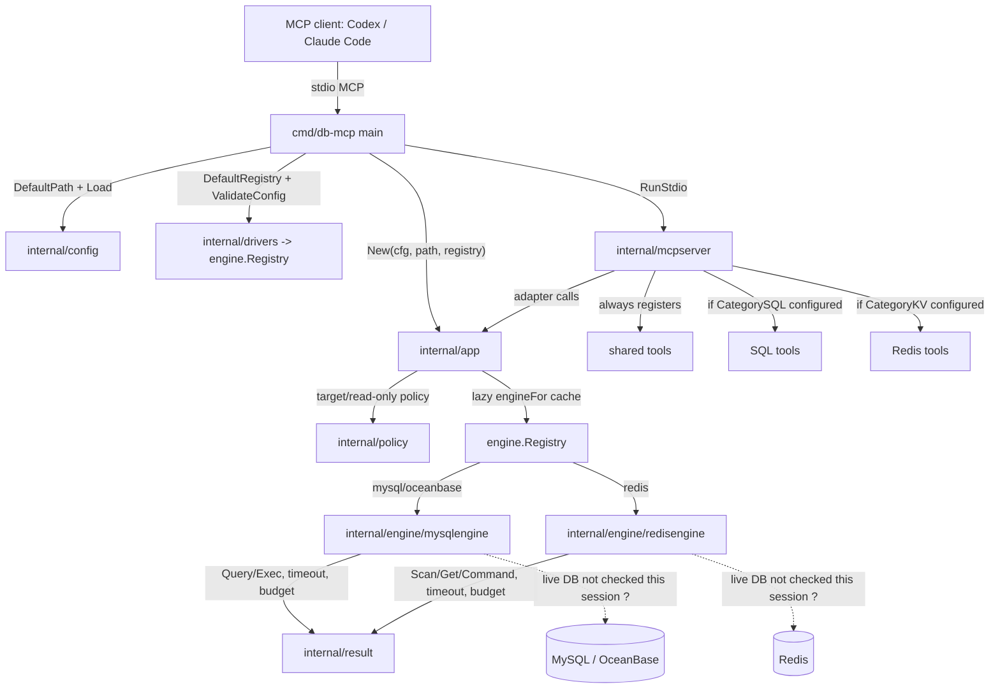

# db-mcp 项目深度分析（忽略既有 research 文档）

**问题**: 在不读取既有 `docs/research/*` 内容的前提下，基于当前工作树重新判断 db-mcp 的定位、架构、行为边界、验证状态和主要风险。
**深度**: Deep
**核心结论**: 当前 db-mcp 已从早期单一 OceanBase/MySQL 工具演进为结构清晰的多引擎 MCP server，离线测试、vet 和构建均通过，但真实数据库 smoke 未运行，剩余主要风险集中在 best-effort 结果预算、原生命令安全边界、少量接口抽象泄漏和历史计划文档陈旧。
**产物类型**: supporting
**验证状态**: code-only
**开放问题**: 5 - see end.

## TL;DR

- 项目定位清楚：面向 Codex 和 Claude Code 的多引擎数据库 MCP stdio server，目标是本地测试环境巡检和有边界数据操作，支持 OceanBase/MySQL/Redis；README 在项目开头直接给出该定位和支持矩阵（`README.md:5-13`）。
- 当前实现已经完成主要架构拆分：`cmd/db-mcp` 只做启动组装，`internal/config` 管配置，`internal/app` 管 use case 和懒加载 engine，`internal/mcpserver` 管 MCP 工具面，`internal/engine/*` 管数据库适配，`internal/policy` 与 `internal/result` 分别承载安全策略和预算/DTO（`cmd/db-mcp/main.go:20-43`, `internal/app/app.go:57-64`, `internal/mcpserver/server.go:24-56`）。
- 安全模型比早期计划强：多数据源时高风险工具必须显式 datasource，read-only 模式拒绝常见 SQL 写入和 Redis raw 大读取，结果有 `max_rows`、`max_value_bytes`、`max_result_bytes` 三层预算（`internal/policy/policy.go:19-28`, `internal/policy/policy.go:56-68`, `internal/policy/policy.go:107-149`, `internal/result/result.go:60-103`）。
- 但它仍不是强安全代理：SQL 不是完整解析，Redis/SQL 的大结果预算大多发生在 driver/client 已经返回值之后，真实数据库连通性本轮没有验证；README 也把 read-only 和 result cap 表述为 best-effort（`README.md:207-212`, `README.md:158-160`）。
- 当前仓库文档有新旧层次：README、examples、release workflow 与源码一致；`docs/multi-db-mcp-architecture.md` 和 `docs/db-mcp-architecture-deepening-plan.md` 更像历史方案/迁移计划，其中部分“待做”已经被当前代码实现，阅读时应以源码为准。

## 研究边界与证据

本次遵守用户要求，没有读取既有 `docs/research/*` 文档内容。为了避免覆盖，仅读取了目标文件是否存在：`test -e docs/research/2026-06-05-db-mcp-project-deep-analysis.md` 返回 `1`，表示本文件名此前不存在；`git ls-files 'docs/research/*' | wc -l` 返回 `0`，表示当前没有已跟踪的 research 文档。

分析对象是当前未提交工作树，而不是某个干净 tag。`git status --short` 在写本文前显示 `README.md`、`README.zh-CN.md`、`cmd/db-mcp/main.go`、`internal/engine/engine.go`、`internal/engine/engine_test.go`、`internal/engine/redisengine/redis.go`、`internal/mcpserver/server.go`、`internal/mcpserver/server_test.go` 已修改，`internal/engine/redisengine/redis_test.go` 已新增，`docs/research/` 未跟踪。本研究把这些当前状态视为事实来源，没有回退任何用户改动。

证据来源包括：README/中文 README、非 research 的 docs 架构/硬化计划、examples、GitHub release workflow、Go 源码、Go 测试、`go test ./...`、`go vet ./...`、`go build ./cmd/db-mcp`、`env | rg '^DB_MCP_TEST'`。

## 研究计划

1. 先界定项目定位和公开工具面：以 README、examples、release workflow 验证用户面和分发面。
2. 再追踪主控制流：从 CLI 入口、配置加载、registry、app、mcpserver 到 engine。
3. 用安全/资源策略作第二条证据线：核对 read-only、datasource resolution、result budget 是否真的在代码中执行。
4. 用测试和命令输出作第三条证据线：验证离线行为是否能被当前测试固定，并标出 live smoke 的缺口。
5. 保留一条反证线：找 README/历史 docs 与当前代码不一致或容易误导的位置。

## 项目地图

这张图确认了源码中的控制/数据流和模块边界；仍未验证的是当前环境下对真实 MySQL/OceanBase/Redis 实例的连通性与端到端行为。

## 当前系统事实

| 维度 | 当前事实 | 证据 | 判断 |
|---|---|---|---|
| 项目定位 | 多引擎数据库 MCP server，面向 Codex/Claude Code、本地测试环境巡检和有边界数据操作 | `README.md:5-13` | 定位明确，且中英 README 同步表达该方向（`README.zh-CN.md:5-12`）。 |
| 支持引擎 | OceanBase(MySQL 协议)、MySQL、Redis | `README.md:9-13`; `internal/drivers/registry.go:9-12` | README 与 registry 一致。 |
| 工具面 | shared 工具始终注册；SQL/Redis 工具按配置中出现的 category 条件注册 | `README.md:30-49`; `internal/mcpserver/server.go:27-54` | 条件注册已落地，不只是文档承诺。 |
| 启动入口 | CLI 只解析 `--config`/`--version`，加载配置，创建 registry/app，启动 stdio server | `cmd/db-mcp/main.go:20-43` | `cmd` 已是 composition root，没有承载业务逻辑。 |
| 配置来源 | 未传 `--config` 时按 `DB_MCP_CONFIG`、`$CLAUDE_PROJECT_DIR/.db-mcp.toml`、当前目录 `.db-mcp.toml` 查找 | `internal/config/config.go:45-53`; `README.md:214-219` | 代码与 README 一致。 |
| 配置默认值 | `max_rows=500`、`query_timeout_seconds=30`、`max_value_bytes=65536`、`max_result_bytes=1048576` | `internal/config/config.go:15-19`, `internal/config/config.go:78-91`; `examples/db-mcp.toml.example:1-5` | examples 与代码默认值一致。 |
| 多数据源默认规则 | 单数据源可省略 default；多数据源必须显式配置 default | `internal/config/config.go:61-75`; `internal/config/config_test.go:19-53` | 规则有单测覆盖。 |
| 懒连接 | app 创建时只保存 config/registry 并初始化 engine map；实际 engine 在 `engineFor` 中按需创建和缓存 | `internal/app/app.go:57-64`, `internal/app/app.go:290-307` | 启动阶段不做真实 DB 操作；registry validation 只验证 driver 名称（`internal/engine/engine.go:76-84`）。 |
| registry | `mysql`/`oceanbase` 走 SQL category，`redis` 走 KV category，显式注册而非跨包 `init` | `internal/engine/mysqlengine/mysql.go:18-25`; `internal/engine/redisengine/redis.go:17-27`; `internal/drivers/registry.go:9-12` | 可扩展性比早期单文件设计强。 |
| MCP SDK 边界 | 生产代码中 MCP SDK import 只出现在 `internal/mcpserver/server.go` | `rg -n "modelcontextprotocol/go-sdk|internal/mcpserver" -g '*.go'` 输出；`internal/mcpserver/server.go:6` | MCP 依赖集中度好；测试文件也会 import MCP SDK。 |
| 发布流程 | tag 触发 release workflow，跨平台构建 `./cmd/db-mcp`，打包 README 和 example | `.github/workflows/release.yml:41-58`, `.github/workflows/release.yml:81-99` | 分发路径与 README build command 一致。 |

## 关键链路分析

### 1. 启动链路

启动链路是 `flag.Parse` -> `config.Load` -> `drivers.DefaultRegistry` -> `registry.ValidateConfig` -> `app.New` -> `mcpserver.RunStdio`。代码直接显示这些步骤顺序（`cmd/db-mcp/main.go:20-43`）。

重要细节：

- `config.Load` 只解析 TOML、应用默认值、校验 datasource/default，不连接数据库（`internal/config/config.go:55-75`）。
- `registry.ValidateConfig` 只遍历 datasource 并检查 driver 是否注册（`internal/engine/engine.go:76-84`）。
- `app.New` 只保存配置和创建 `engines` map（`internal/app/app.go:57-64`）。
- 真实 engine 构造发生在 `engineFor`，且首次使用后缓存（`internal/app/app.go:290-307`）。

结论：README 的“Lazy connections”与当前代码一致；本轮没有用真实 DB 验证连接行为，只能确认代码路径没有在启动阶段主动查询数据库。

### 2. 工具注册链路

`mcpserver.New` 始终注册 `list_datasources`、`current_datasource`、`get_current_time`（`internal/mcpserver/server.go:27-29`）。然后读取 `application.ConfiguredCategories()` 和 config（`internal/mcpserver/server.go:31-32`），如果存在 SQL category，就注册 SQL 工具（`internal/mcpserver/server.go:41-46`）；如果存在 KV category，就注册 Redis 工具（`internal/mcpserver/server.go:48-54`）。

这一点有测试覆盖：

- SQL-only app 的工具集合包含 shared + SQL 工具（`internal/mcpserver/server_test.go:60-77`）。
- KV-only app 不注册 SQL 工具（`internal/mcpserver/server_test.go:208-233`）。
- Redis-only app 注册 shared + Redis 工具（`internal/mcpserver/server_test.go:385-403`）。

结论：工具面按 datasource category 条件注册的设计已经落地，能减少 LLM 客户端在不相关 datasource 类型上的误用概率。

### 3. datasource 选择和高风险工具

普通读工具通过 `DatasourceName(input, default)` 允许省略 datasource（`internal/policy/policy.go:12-17`）。高风险工具 `execute_sql` 和 `redis_command` 走 `DatasourceNameForTool`：多数据源时如果省略 datasource，会返回错误（`internal/policy/policy.go:19-28`）。`mcpserver` 也在 schema 层根据 `len(cfg.Datasources) > 1` 让 datasource 成为 required 字段（`internal/mcpserver/server.go:63-90`）。

相关测试：

- 多数据源时 `execute_sql`/`redis_command` 的 schema 要求 datasource（`internal/mcpserver/server_test.go:98-117`）。
- 单数据源时 datasource 仍可省略（`internal/mcpserver/server_test.go:119-131`）。
- 多数据源下省略 datasource 的实际调用会报错（`internal/mcpserver/server_test.go:585-609`, `internal/mcpserver/server_test.go:656-680`）。

结论：该策略解决了“合法调用落到错误默认库”的一类高风险误用；这是服务端策略与 MCP schema 双层防线。

### 4. SQL engine

MySQL/OceanBase 共用 `go-sql-driver/mysql`：factory 同时注册 `mysql` 和 `oceanbase`，二者 category 都是 SQL（`internal/engine/mysqlengine/mysql.go:18-25`）。`newSQLEngine` 构造 DSN，设置 TCP 地址、database、ParseTime、timeout、charset、连接池大小等（`internal/engine/mysqlengine/mysql.go:35-62`）。

SQL 操作：

- `CurrentTime` 调用 `SELECT NOW() AS now`（`internal/engine/mysqlengine/mysql.go:69-71`）。
- `ListTables` 调用 `SHOW TABLES`（`internal/engine/mysqlengine/mysql.go:73-75`）。
- `DescribeTable` 和 `SampleTable` 先通过 `quoteIdentifier` 限制表名，再拼接 SHOW/SELECT（`internal/engine/mysqlengine/mysql.go:77-91`, `internal/engine/mysqlengine/mysql.go:163-170`）。
- `Query` 使用 context timeout、`maxRows` 和 result budget；达到行数或字节预算后标记 truncated（`internal/engine/mysqlengine/mysql.go:93-140`）。
- `Exec` 同样用 timeout，并预算 SQL 文本预览（`internal/engine/mysqlengine/mysql.go:143-160`）。

判断：

- SQL 表名 helper 的 `[A-Za-z0-9_]+` 限制偏保守，能避免 identifier 注入，但不支持 `schema.table`、带连字符或其他合法 quoted identifier（`internal/engine/mysqlengine/mysql.go:163-170`）。
- SQL read-only 不是完整解析，README 已明确这是 best-effort，不能阻止 `SELECT` 内副作用函数等情况（`README.md:207-212`）。

### 5. Redis engine

Redis engine 用 `go-redis/v9`，构造 client 时设置 addr、username/password、DB、timeout、pool size（`internal/engine/redisengine/redis.go:37-58`）。它实现 KV 能力：scan/get/type/ttl/command（`internal/engine/engine.go:26-33`）。

Redis 专用工具的资源边界：

- `redis_scan` 默认 pattern 为 `*`，count 经 `capCount` 限制到 `maxRows`，迭代时本地再用 `len(keys) >= limit` 截断（`internal/engine/redisengine/redis.go:68-73`, `internal/engine/redisengine/redis.go:97-131`）。
- `redis_get` 先 `TYPE`，按 string/list/set/hash/zset 分支读取；string 先 `STRLEN`，超过 `max_value_bytes` 时用 `GETRANGE` 取前缀；collection 类型用 LLEN/SCARD/HLEN/ZCARD 判断总量，再按 `maxRows` 取样并标记 element truncation（`internal/engine/redisengine/redis.go:161-283`）。
- `redis_command` 非 read-only 下会执行任意 argv 命令，然后对返回值做预算归一化（`internal/engine/redisengine/redis.go:285-310`）。

Redis read-only 原生命令策略：

- allowlist 包含小结果或参数受限命令，例如 `PING`、`TIME`、`TYPE`、`TTL`、`EXISTS`、`STRLEN`、`GETRANGE`、`HLEN`、`LLEN`、`SCARD`、`ZCARD` 等（`internal/policy/policy.go:77-105`）。
- 未在 allowlist 的命令会被拒绝，并提示使用 `redis_get`/`redis_scan` 做 bounded 读取（`internal/policy/policy.go:107-115`）。
- `EXISTS` 参数数量受 `maxRows` 控制，`GETRANGE`/`SUBSTR` 范围不能超过 `max_value_bytes`（`internal/policy/policy.go:116-149`）。
- 测试覆盖了 allow/reject 矩阵，包括拒绝 `SET`、`DEL`、`FLUSHALL`、`KEYS`、`SCAN`、`MGET`、`GET`、`HGETALL`、`LRANGE`、`ZRANGE` 等 raw command（`internal/policy/policy_test.go:32-49`, `internal/mcpserver/server_test.go:631-654`）。

判断：

- `redis_get`/`redis_scan` 是当前设计中真正 bounded 的 Redis 读取路径。
- `redis_command` 在非 read-only 下仍是 raw escape hatch；虽然返回值会被预算裁剪，但 Redis client 已经先拿到原始结果（`internal/engine/redisengine/redis.go:296-305`）。因此它不是内存级硬边界。

### 6. 结果预算

`result.Limits` 由 `MaxRows`、`MaxValueBytes`、`MaxResultBytes` 组成（`internal/result/result.go:10-22`）。`Budget.NormalizeText` 先按 `MaxValueBytes` 截断单值，再按 `MaxResultBytes` 截断累计文本字节（`internal/result/result.go:60-82`）；`AccountScalar` 用 `fmt.Sprint` 估算 scalar 占用（`internal/result/result.go:84-103`）。

优点：

- SQL cell、Redis string/bulk value、nested array/map 都有共同预算逻辑（`internal/result/result.go:175-251`）。
- 测试覆盖 DB value 和 Redis value 的 value/result truncation（`internal/result/result_test.go:8-28`）。

弱点：

- `MaxResultBytes` 是近似预算，不包含 JSON 结构开销；README 称其为 best-effort，与实现一致（`README.md:158-160`）。
- `NormalizeText` 用 `value[:limit]` 按字节切字符串，可能切断 UTF-8 多字节字符；本次没有新增复现测试，属于由代码结构推出的风险（`internal/result/result.go:64-80`）。
- 对 SQL 来说，Go 层预算发生在 `rows.Scan` 之后，README 已说明大 SQL cell 仍可能在截断前消耗 driver 内存（`internal/engine/mysqlengine/mysql.go:122-128`, `README.md:207-210`）。
- 对 Redis raw command 来说，预算发生在 `client.Do(...).Result()` 之后，也不能阻止 Redis client 先接收大结果（`internal/engine/redisengine/redis.go:296-305`）。

## 文档和历史计划状态

当前 README、examples、workflow 与源码大体一致：

- README build command 使用 `go build ... ./cmd/db-mcp`（`README.md:69-77`），release workflow 也构建 `./cmd/db-mcp`（`.github/workflows/release.yml:53-56`）。
- README 配置默认值和 example TOML 一致（`README.md:118-126`, `examples/db-mcp.toml.example:1-9`）。
- Codex/Claude 示例都指向 `.db-mcp.toml`（`examples/codex-config.toml:1-7`, `examples/mcp.json:1-10`）。

非 research 的 docs 更像历史方案：

- `docs/multi-db-mcp-architecture.md` 开头仍提到 `ob-mcp` 到多引擎迁移，以及当时读过 `main.go`、`examples/ob-mcp.toml.example`（`docs/multi-db-mcp-architecture.md:1-4`），但后面又记录已决定改名为 `db-mcp` 且不保留 fallback（`docs/multi-db-mcp-architecture.md:137-140`）。
- `docs/db-mcp-architecture-deepening-plan.md` 提出的目标结构与当前目录高度一致（`docs/db-mcp-architecture-deepening-plan.md:13-25`），但它仍以“推荐行动计划/Phase”方式描述迁移（`docs/db-mcp-architecture-deepening-plan.md:35-49`, `docs/db-mcp-architecture-deepening-plan.md:297-422`）。

判断：这些 docs 对理解演进有价值，但不能作为当前实现的权威说明；README、源码、测试应优先。

## 验证结果

本轮验证命令：

| 检查 | 结果 | 解释 |
|---|---|---|
| `go test ./...` | 通过 | 所有包单元测试通过；输出包括 `internal/config`、`internal/drivers`、`internal/engine`、`internal/engine/redisengine`、`internal/mcpserver`、`internal/policy`、`internal/result`。 |
| `go vet ./...` | 通过 | 命令无输出，退出码 0。 |
| `go build ./cmd/db-mcp` | 通过 | 命令无输出，退出码 0；该命令生成的临时根目录二进制已删除。 |
| `env | rg '^DB_MCP_TEST'` | 无输出，退出码 1 | 当前环境没有 live smoke 变量。 |

测试边界：

- Redis live smoke 只有在 `DB_MCP_TEST_REDIS=host:port` 设置时运行，否则跳过（`internal/mcpserver/server_test.go:405-457`）。
- SQL live smoke 只有在 `DB_MCP_TEST_MYSQL` 或 `DB_MCP_TEST_OCEANBASE` 等变量设置时运行，否则跳过（`internal/mcpserver/server_test.go:459-535`）。
- README 也把 live smoke 描述为可选、由环境变量触发（`README.md:306-322`）。

因此，本轮验证状态是 code-only：可以证明代码能编译、静态检查通过、离线单测通过；不能证明真实数据库连接、网络超时、权限/ACL、不同 MySQL/OceanBase/Redis 版本上的端到端行为。

## 主要风险

1. **安全边界是 best-effort，不是强隔离**
   SQL read-only 基于首词和 `INTO OUTFILE/DUMPFILE` regex，不做完整 SQL 解析（`internal/policy/policy.go:54-68`）。README 明确建议硬保证还需要只读数据库账号或 Redis ACL/read-only replica（`README.md:207-212`）。

2. **raw 命令预算不等于内存硬上限**
   SQL `rows.Scan` 和 Redis `client.Do(...).Result()` 都先产生 driver/client 侧值，再进入 `result` 预算归一化（`internal/engine/mysqlengine/mysql.go:122-128`, `internal/engine/redisengine/redis.go:296-305`）。这可以限制 MCP 响应体，但不能保证数据库客户端内存使用。

3. **`Engine.CurrentTime` 泄漏 SQL-shaped DTO 到 KV 抽象**
   基础 `Engine` 接口把 `CurrentTime` 定义为返回 `result.SQLResult`（`internal/engine/engine.go:11-15`），Redis engine 也返回 SQL-like columns/data（`internal/engine/redisengine/redis.go:82-94`）。当前可用，但抽象上把“通用元信息”绑定到 SQL DTO。

4. **表名 quoting 过于保守**
   `quoteIdentifier` 只接受 `[A-Za-z0-9_]+`（`internal/engine/mysqlengine/mysql.go:163-170`）。这降低注入风险，但会拒绝 schema-qualified table、带特殊字符的合法标识符，以及部分真实库命名风格。

5. **历史计划文档可能误导后续维护者**
   非 research docs 中有已过期上下文和已落地的“待做计划”。如果未来维护者把这些 plan 当当前真相，可能重复做已完成的迁移或误判 build path/项目名。

6. **当前结论绑定未提交工作树**
   研究基于当前 dirty working tree。若这些改动尚未合并或之后被改写，本报告的实现结论需要重新跑证据检查。

## 本报告不决定的事项

- 不判断项目是否适合生产库或生产审计网关；当前 README 定位是本地测试环境（`README.md:5-7`）。
- 不判断外部 GitHub release 是否已经存在；本轮只读取了本地 workflow，没有查询远端。
- 不评估真实 MySQL/OceanBase/Redis 的版本兼容性；live smoke 未运行。
- 不提出或执行代码修改；这是 research 产物，不是 implementation pass。

## 开放问题

1. 是否要把 MySQL/OceanBase/Redis live smoke 变成 CI 中可选但标准化的 Docker/服务矩阵，而不是只依赖本机 `DB_MCP_TEST_*`？
2. SQL table 工具是否需要支持 `schema.table` 或更完整的 quoted identifier？如果需要，`quoteIdentifier` 的安全模型要重新设计。
3. `redis_command` 是否应在默认非 read-only 模式下也加更严格的 raw result 风险提示或命令 denylist，而不是只靠 MCP `destructiveHint` 和输出预算？
4. 是否要把 `get_current_time` 的返回类型从 `SQLResult` 抽成 engine-neutral DTO，降低 KV engine 与 SQL-shaped result 的耦合？
5. 是否要把 `docs/multi-db-mcp-architecture.md` 和 `docs/db-mcp-architecture-deepening-plan.md` 标记为 superseded/历史设计，避免与当前源码事实冲突？

## Source Audit

| 主张 | 来源 | 获取方式 |
|---|---|---|
| 项目是多引擎数据库 MCP server，面向 Codex/Claude Code 和本地测试环境 | `README.md:5-13` | read in this session |
| 工具面包含 shared、SQL、Redis 三组 | `README.md:30-49`; `internal/mcpserver/server.go:27-54` | read in this session |
| CLI 入口只做配置加载、registry/app 组装和 stdio server 启动 | `cmd/db-mcp/main.go:20-43` | read in this session |
| 配置默认路径顺序是 DB_MCP_CONFIG、CLAUDE_PROJECT_DIR、当前目录 | `internal/config/config.go:45-53`; `README.md:214-219` | read in this session |
| datasource 默认值和多数据源 default 规则有代码和测试覆盖 | `internal/config/config.go:61-75`; `internal/config/config_test.go:19-53` | read in this session |
| engine 是懒创建和缓存的 | `internal/app/app.go:57-64`; `internal/app/app.go:290-307` | read in this session |
| built-in drivers 是 mysql/oceanbase/redis | `internal/drivers/registry.go:9-12`; `internal/drivers/registry_test.go:10-29` | read in this session |
| 高风险工具多数据源时要求显式 datasource | `internal/policy/policy.go:19-28`; `internal/mcpserver/server.go:63-90`; `internal/mcpserver/server_test.go:98-131` | read in this session |
| SQL read-only 是 best-effort | `internal/policy/policy.go:54-68`; `README.md:207-212` | read in this session |
| Redis read-only raw command 有 allowlist 和参数限制 | `internal/policy/policy.go:77-149`; `internal/policy/policy_test.go:32-56` | read in this session |
| 结果预算包含 max rows/value/result 三层 | `internal/result/result.go:10-22`, `internal/result/result.go:60-103`; `README.md:158-160` | read in this session |
| `go test ./...`、`go vet ./...`、`go build ./cmd/db-mcp` 通过 | command outputs in this session | ran in this session |
| live smoke 本轮未运行 | `env | rg '^DB_MCP_TEST'` no output; `internal/mcpserver/server_test.go:405-535` | ran/read in this session |
